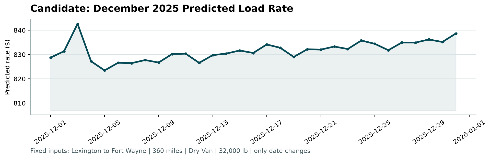

# Freight Rate Prediction Challenge

Production-ready machine learning pipeline for freight load rate prediction (`posted_rate` in USD), developed for the Spotter Machine Learning Engineer Assessment.

---

## 1. Project Overview

The objective is to predict spot freight rates based on load attributes, historical freight routes, equipment specifications, market indices, and temporal features.

- **Development Data**: `data/train_test.csv` (48,000 loads, Jan 1, 2025 to Oct 31, 2025)
- **Validation Data**: `data/validation.csv` (12,000 loads, Nov 1, 2025 to Dec 31, 2025)
- **Fixed December Series**: `data/december_chart_inputs.csv` (31 daily loads, Lexington to Fort Wayne, 360 miles, Dry Van)
- **Evaluation**: Scored against `score.py` enforcing output formatting, positive rate constraints, and load ID alignment

---

## 2. Project Architecture

```
Spotter's ML Engineer Assessment/
├── .venv/                                   # Python 3.11 virtual environment
├── data/
│   ├── train_test.csv                       # Historical training data (48,000 rows)
│   ├── validation.csv                       # Unlabeled validation data (12,000 rows)
│   ├── validation_predictions_template.csv  # Template filled by 04_predict.py
│   └── december_chart_inputs.csv           # Filled December daily predictions
├── src/
│   ├── 01_eda.py                            # Exploratory data analysis and summary stats
│   ├── 02_feature_engineering.py           # Reusable FeaturePipeline transformer
│   ├── 03_train.py                          # Time-based validation and ensemble training
│   └── 04_predict.py                        # Inference script for submission files
├── models/
│   └── model.pkl                            # Serialized pipeline and ensemble models
├── scorer_results/
│   └── candidate_december.png              # Output chart generated by score.py
├── validation_predictions.csv              # Submission predictions (12,000 rows)
├── requirements.txt                         # Official scorer and ML dependencies
├── score.py                                 # Official validation script (do not modify)
├── REPORT.md                                # Comprehensive technical assessment report
└── README.md                                # This file
```

---

## 3. Installation and Setup

Used Python 3.11.3 on Windows

```powershell

# Install scorer and machine learning dependencies
pip install -r requirements.txt
```

---

## 4. Pipeline Execution (Step by Step)

Each script is independent and must be run from the project root folder.

### Step 1: Exploratory Data Analysis

Inspect distributions, correlations, missing values, and temporal patterns:

```powershell
.venv\Scripts\python.exe src\01_eda.py
```

### Step 2: Feature Engineering Verification

Verify feature transformations, city coordinate lookup, and null handling:

```powershell
.venv\Scripts\python.exe src\02_feature_engineering.py
```

### Step 3: Model Training and Time-Split Validation

Evaluates Ridge Baseline vs. LightGBM vs. Ensemble on the October 2025 holdout, then trains the final production ensemble on all 48,000 historical loads and saves `models/model.pkl`:

```powershell
.venv\Scripts\python.exe src\03_train.py
```

### Step 4: Generate Submission Predictions

Generates `validation_predictions.csv` at the project root and populates `data/december_chart_inputs.csv` with 31 daily predictions:

```powershell
.venv\Scripts\python.exe src\04_predict.py
```

### Step 5: Validate with Official Scorer

Validates output integrity and renders the December rate chart at `scorer_results/candidate_december.png`:

```powershell
.venv\Scripts\python.exe score.py --predictions validation_predictions.csv --december-predictions data/december_chart_inputs.csv
```

---

## 5. Validation Results

A rigorous **temporal holdout split** was used to simulate real-world forecasting conditions:

- **Training**: Jan 1, 2025 to Sep 30, 2025 (43,147 loads)
- **Holdout Validation**: Oct 1, 2025 to Oct 31, 2025 (4,853 loads)

| Model Architecture | RMSE ($) | MAE ($) | MAPE (%) | R2 Score |
| :--- | :---: | :---: | :---: | :---: |
| Ridge Regression (Baseline) | $653.37 | $135.83 | 7.79% | 0.8173 |
| LightGBM Regressor | $664.81 | $152.61 | 6.84% | 0.8108 |
| **Weighted Ensemble (85% LGBM + 15% Ridge)** | **$660.90** | **$143.43** | **6.51%** | **0.8131** |

### December 2025 Fixed Route Prediction Chart

Route: Lexington, KY → Fort Wayne, IN | 360 miles | Dry Van | 32,000 lbs



> Predicted rates average **$831.55/load** ($2.31/mile) across all 31 December days, exhibiting realistic midweek peaks and weekend dips — no artificial flatlining.

---

## 6. Output Verification Summary

Running `score.py` confirms all submission constraints are satisfied:

```
Validated 12,000 final predictions.
Validated 31 fixed December predictions.
Created chart: scorer_results\candidate_december.png
Final validation metrics are calculated by Spotter after submission.
```

- Validated **12,000** predictions matching `validation.csv` IDs (`TE-000001` through `TE-012000`)
- Strictly positive predicted rates (range: $169.44 to $7,380.86, mean: $2,378.55)
- Validated **31** daily December predictions with exact 7-column schema preserved
- Output chart generated at `scorer_results/candidate_december.png`
